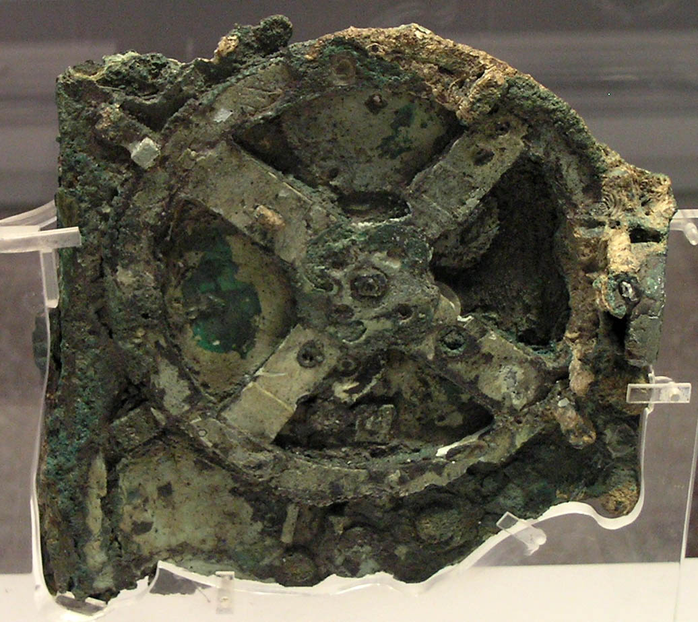
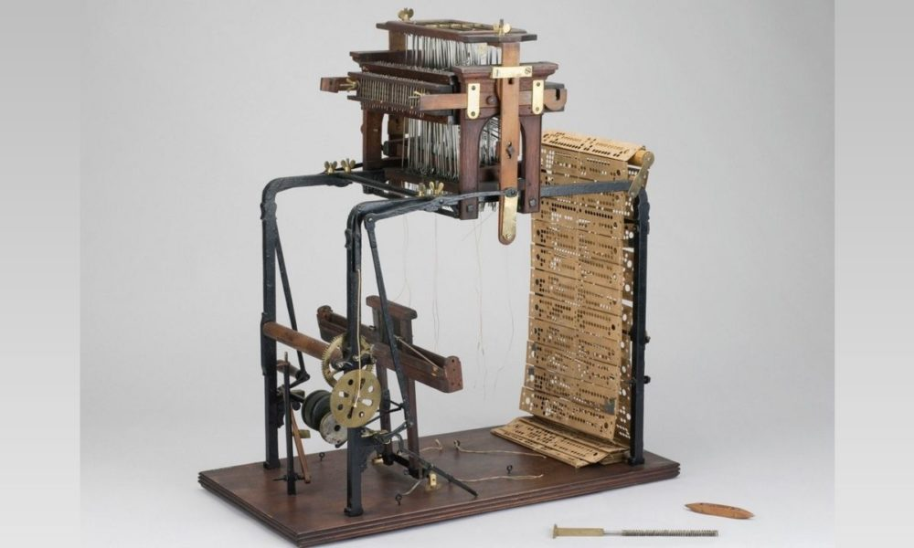
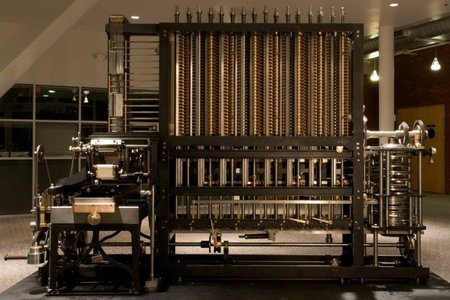
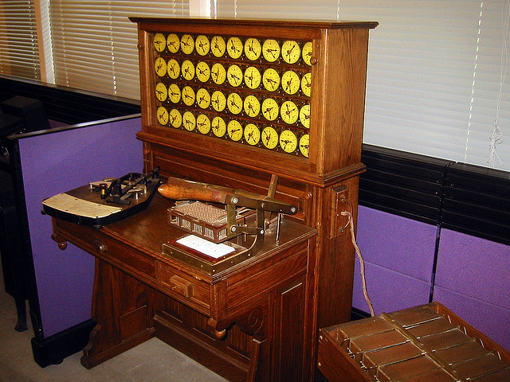
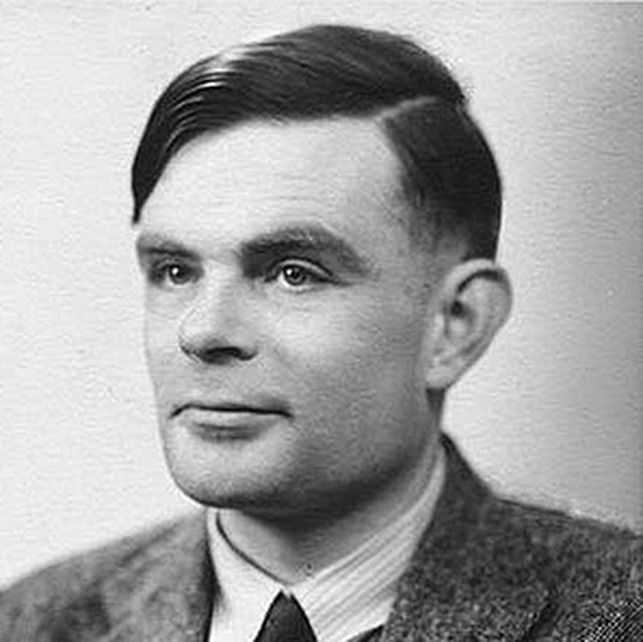
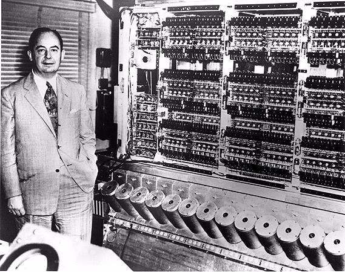
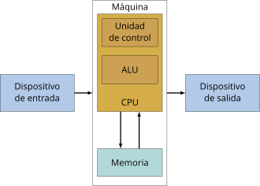
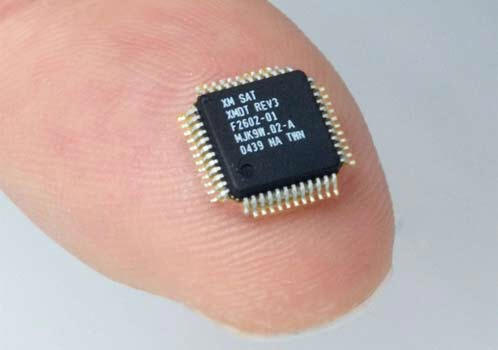
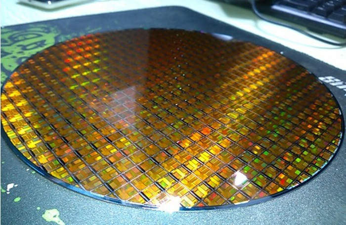
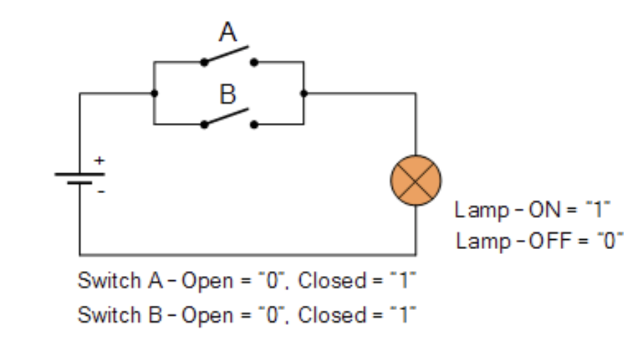

# Introducción al pensamiento computacional
## Introducción al cómputo

Posiblemente la primera computadora fue creada por los **antiguos griegos** el cual tenia el propósito de calcular las posiciones del Sol, Luna y algunos otros cuerpos celestes.

<h5>Mecanismo Anticitera</h5>

Miles de años después se creo el **telar de Jacquard**, que funcionaba con tarjetas que se creaban con aujeros que representaban la información que el telar tenía que hacer en un pedazo de tela.

<h5>Telar de Jacquard</h5>

Después llego el **motor analítico de Charles Babbage**, el cual ocupó la tecnología de punta en su época para poder realizar cálculos.

<h5>Motor analítico de Charles Babbage</h5>

A finales del siglo XIX el gobierno de EE.UU. tenia serios problemas para realizar los censos como mandaba la constitución. En este momento fue cuando llegó la **máquina tabuladora**, la cual se utilizó para realizar los censos con tarjetas, obteniendo resultados más rápidos y certeros.

<h5>Máquina Tabuladora</h5>

Antiguamente existía la **profesión de computadora**, la cual eran personas que se dedicaban a seguir ciertas instrucciones para obtener los resultados. Sin embargo estos resultados estaban plagados de errores. Al inicio del siglo XX ya existían compañías que tenían la necesidad de realizar cálculos exactos y a gran escala. Es aquí donde llegan **Alan Turing** y **Alonzo Church** con la idea de que todos los algoritmos desarrollados por la humanidad podían ser reducidas a una máquina imaginaria, que tuviera una cinta infinita donde apuntarían símbolos y estos símbolos se pudieran manipular. Gracias a esa idea, se comenzó la carrera para crear la primera computadora electrónica, el cual fue el **ENIAC**.

<h5>Alonzo Chruch, Alan Turing y la maquina ENIAC respectivamente.</h5>

**John von Neumann** se dio cuenta de que en el hardware no solo se podía almacenar el poder de cómputo, también los programas para ejecutar. A esta arquitectura se le llama la **arquitectura de von Neumman.** De esta arquitectura nace la máquina **EDVAC** (Electronic Discrete Automatic Computer).

<h5>John von Neumann junto a la máquina EDVAC.</h5>

<h5>La arquitectura von Neumann.</h5>

Con la llegada de los **microchips** llegó la pauta para la computación de hoy en día. Estos microchips, con el tiempo, lograron ser tan pequeños gracias a la tecnología de la **fotónica.**

<h5>Microchip y Oblea de Silicio respectivamente.</h5>

Ya en nuestros tiempos llegó la **nube**, que son data centers que no son más que miles o millones de computadoras.

<h5>Sala de servidores de una nube.</h5>

## Computer Science

Computer Science (CS) es el estudio de procesos algorítmicos, sistemas computacionales y las computadoras per se. A continuación se darán a conocer las tres principales áreas de estudio.

### Teoria Computacional

Aquí se encuentra el aprendizaje y análisis de algoritmos. Un algoritmo es una sucesión de pasos ordenados que al repetirse de forma sistemática logra resolver un problema. A su vez, los algoritmos traen consigo un nuevo concepto: la complejidad.
Por otro lado, en este mismo se encuentra la teoría de grafos, criptografía, hardware y estructuras de datos. Estos últimos se utilizan para organizar los datos de forma eficiente para su posterior uso.

### Aplicaciones

Por otro lado, existe la inteligencia artificial, robótica, machine learning, satisfacibilidad booleana,  procesamiento de imágenes, procesamiento de lenguaje natural, realidad aumentada. Por último, big data y lo que se conoce como hacking ético.

### Ingeniería Computacional

En última instancia, ingeniería computacional. En esta instancia podemos encontrar ingeniería del software, donde prevalece el desarrollo del mismo. El conocimiento y desarrollo de diversos lenguajes de programación, arquitectura de computadoras, compiladores de código, entre otros.

## Circuitos Eléctricos

Para poder entender el funcionamiento de una computadora y sus orígenes, antes tenemos que conocer qué es y cómo funciona un circuito eléctrico.
Un circuito eléctrico es una interconexión de componentes eléctricos que transporta corriente eléctrica a través de una trayectoria cerrada. Imaginemos una batería, ahora pensemos que dicha batería está conectada a través de cables a una lámpara, si deseamos prender la lámpara necesitamos que la misma reciba corriente, ¿Cómo haríamos eso? Podemos tener un interruptor que, al cerrarlo prende la lámpara.

En el caso ilustrado para poder prender la lámpara necesitamos cerrar tanto A como B. Esto se debe a que si cierro A pero no B, la energía de la batería logra llegar hasta el interruptor B, pero dado que el interruptor B está abierto, la energía se pierde y por lo tanto no llega al otro extremo derecho, no llega a la lámpara.
Si A está abierto, pero B cerrado, la energía no llega al interruptor B, y por consiguiente, la lámpara no podría prenderse.
En el caso de que tanto el interruptor A como el interruptor B estén cerrados, la energía logra fluir hasta llegar a la lámpara y lograr prenderla.

Una alternativa, sería colocar dos interruptores de forma paralela de forma tal que si cierro uno, pero mantengo el otro abierto, la energía tiene un camino alternativo por donde pasar.

En este caso, si cierro el interruptor A pero mantengo el interruptor B abierto, la lámpara se prende igual. Esto se debe a que la energía de la batería pasa por el camino cerrado hasta alcanzar la lámpara. Análogo es el caso en el que el interruptor A está abierto y el interruptor B cerrado.

Si buscamos asociar lo ya mencionado a lógica, podríamos considerar que cuando el interruptor está abierto su valor es 0 y cuando el interruptor está cerrado su valor es 1. Y la lámpara encendida es 1. Por lo tanto, en el primer caso, para poder prender la lámpara necesitamos que tanto el interruptor A como el interruptor B estén cerrados, es decir que ambos valores estén en 1. En el segundo caso, con que uno esté abierto ya es suficiente, por lo tanto podríamos tener A con un valor 0 y B con un valor 1 o viceversa, o ambos con valor 1.

En conclusión, el uso de interruptores en serie (primer caso) representa un AND, y el uso de interruptores en paralelo (segundo caso) representa un OR. A partir de diversas combinaciones podremos lograr cada uno de los conectores lógicos.

#### Conectores Lógicos

A continuación y a modo de repaso, las tablas de verdad para cada uno de los conectores lógicos más utilizados: AND, OR, XOR, NOT

A | B | AND
--| --| --
1 | 1 |  1
1 | 0 |  0
0 | 0 |  0
0 | 1 |  0

A | B | OR
--| --| --
1 | 1 |  1
1 | 0 |  1
0 | 0 |  0
0 | 1 |  1

A | B | XOR
--| --| --
1 | 1 |  0
1 | 0 |  1
0 | 0 |  0
0 | 1 |  1

A | NOT
--| --
1 |  0
0 |  1

## Half Adder

En función de las compuertas o puertas lógicas y a través de la combinación de estas podemos lograr diversas operaciones, por ejemplo un sumador de números.
En la escuela nos enseñaron a sumar con números decimales pero, las computadoras en su interior trabajan con un sistema binario, es decir sistema numérico de dos dígitos el 1 y el 0.
Por ejemplo, si quisiéramos sumar 19+24 sabemos que la suma de 9+4 = 13, por lo tanto en el resultado final en la unidad nos queda un 3 y debemos “llevarnos” la decena. Luego, para la decena debemos sumar 1 + 2 + 1 = 4. Obteniendo como resultado final 43.
En el Half Adder, ese rol de acarreo lo hace la puerta lógica AND mientras que el XOR efectúa la suma. Si quisiéramos trasladar el mismo ejemplo ya mencionado, en primer lugar debemos conocer cual es el valor de 19 y 24 en binario. Más adelante veremos cómo hacer dicha transformación, pero por ahora, confíen que 19 = 10011 y 24 = 11000.

1 | 0   | 0     | 1   | 1
-- | --- | ----- | ----| ---
1| 1 | 0  |0 |0

Comenzando de derecha a izquierda. 1 AND 0 = 0 por lo tanto NO acarreo, y por otro lado debo hacer 1 XOR 0 = 1. El segundo, es análogo

1 | 0   | 0     | 1   | 1
-- | --- | ----- | ----| ---
1| 1 | 0  |0 |0
| |   |1 |1

0 AND 0 = 0, NO acarreo. Luego, 0 XOR 0 = 0. Por lo tanto,

1 | 0   | 0     | 1   | 1
-- | --- | ----- | ----| ---
1| 1 | 0  |0 |0
|1 |  0 |1 |1

Llegamos al último caso, 1 AND 1 = 1, por lo tanto hay acarreo.

1|1 | 0   | 0     | 1   | 1
--|-- | --- | ----- | ----| ---
|1| 1 | 0  |0 |0
||1 |  0 |1 |1

1 XOR 1 = 0

1|1 | 0   | 0     | 1   | 1
--|-- | --- | ----- | ----| ---
|1| 1 | 0  |0 |0
|0|1 |  0 |1 |1

Se completa con 0s. Por lo tanto, resta resolver 1 AND 0 = 0, NO hay acarreo. 1 XOR 0 = 1.

1|1 | 0   | 0     | 1   | 1
--|-- | --- | ----- | ----| ---
0|1| 1 | 0  |0 |0
1|0|1 |  0 |1 |1

101011 = 43

## Sistemas de Numeración

### Sistema Unario

Es el sistema de numeración más simple, posee un único símbolo para representar todos los números existentes. Supongamos que el símbolo elegido sea “I”, si quisiéramos representar el número 3 del sistema decimal, lo haríamos de la siguiente manera: “III”. Su principal desventaja es que no nos permite simbolizar de forma cómoda y rápida un conjunto con muchos elementos.

### Números Romanos

En este caso existen 7 símbolos o signos para representar todos los números posibles. El orden de estos símbolos, importa, se basa en un sistema aditivo, cada signo representa un valor que se va sumando al anterior. La numeración romana, luego, evolucionó a un sistema sustractivo, en el cual algunos signos en lugar de sumar, restan. Si el valor a la izquierda es menor, entonces resta.

Por ejemplo:

CXVII = cien + diez + cinco + uno + uno

MCMV = mil  + (mil - cien) + cinco

### Sistemas Posicionales

Un sistema posicional es aquel en donde cada dígito posee un valor que depende de su posición relativa, la cual está determinada por la base, número de dígitos necesarios para escribir cualquier número. En el caso de un sistema decimal, base 10, ya que el número de dígitos es 10, de 0 a 9.

Por lo tanto, además del número de unidades que representa, considerado en forma aislado, tiene un significado o peso distinto según la posición que ocupa en el grupo de caracteres del que forma parte.

### Representación de Cantidades:

Uno de las necesidades principales por las que los humanos creamos los sistemas de numeración, es la de representar cantidades. Supongamos que queremos representar cantidades de estrellas, u usamos sistemas con diferente **base**, es decir, la cantidad de elementos distintos disponibles:

| Base  |   | * | * * | * * * | * * * * | * * * * * | * * * * * * |
| :---  |:-:|:-:| :-: | :---: | :-----: | :-------: | ----------: |
| 10    | 0	| 1	| 2   | 3     | 4       | 5         | 6		        |
| 2     | 0	| 1	| 10  | 11    | 100     | 101       | 110		      |
| 5     | 0	| 1	| 2   | 3     | 4       | 10        | 11		      |

| Base  | * * * * * * * | * * * * * * * * | * * * * * * * * * | * * * * * * * * * * |
| :---  | :-----------: | :-------------: | :---------------: | ------------------: |
| 10    | 7             | 8		            | 9                 | 10                  |
| 2     | 111           | 1000	          | 1001              | 1010                |
| 5     | 12            | 13		          | 14                | 20                  |

### Binario <> Decimal

Ahora es momento de entender cómo transformar un número binario en un número decimal y viceversa. Si queremos realizar una transformación de binario a decimal debemos utilizar la fórmula que se encuentra debajo.

Por ejemplo:
Supongamos 10101, comenzando de derecha a izquierda, cada 1 o 0 será multiplicado por 2^n en donde n describe la posición en el que se encuentra, siendo el más derecho, la posición 0. El resultado final será la sumatoria de todos ellos.

 1 | 0   | 1     | 0   | 1
-- | --- | ----- | ----| ---
2^4| 2^3 |  2^2  | 2^1 | 2^0

Por lo tanto:
1x2^4 + 0x2^3 + 1x2^2 + 0x2^1 + 1x2^0 = 16 + 0 + 4 + 0 + 1 = 21

En cuanto al pasaje de decimal a binario, debemos dividir por dos y quedarnos con el resto, dicho resto va a ser quien nos marque el binario involucrado.

Por ejemplo:
Realizamos la operación inversa, convertimos 21 en binario.

21/2 = 10 (resto 1)
10/2 = 5 (resto 0)
5/2 = 2 (resto 1)
2/2 = 1 (resto 0)
1/2 = 0 (resto 1)

Ahora leemos de abajo hacia arriba los restos, al concatenarlos, obtendremos nuestra solución en binario 10101.

## Lenguaje de Máquina

Recordemos que las computadoras, sólo entienden ceros (0) y unos (1). Ahora bien, ¿Nosotros escribimos en 1's y 0's? No.
Existen lenguajes de alto y bajo nivel que luego deben ser traducidos a lenguaje maquina, lenguaje interpretable por la computadora. La "traducción" la llamaremos compilación.

## Homework

Completa la tarea descrita en el archivo [README](https://github.com/soyHenry/Python-Prep/blob/4aec1885136fdcff98899d2be13c8908b39f8b21/02%20-%20Variables%20y%20Tipos%20de%20Datos/Prep_Course_Homework_02.md)

<table class="hide" width="100%" style='table-layout:fixed;'>
  <tr>
    <td>
      <a href="https://airtable.com/shrSzEYT4idEFGB8d?prefill_clase=00-PrimerosPasos">
        
         
        Hacé click acá para dejar tu feedback sobre esta clase.
      </a>
    </td>
  </tr>
</table>
